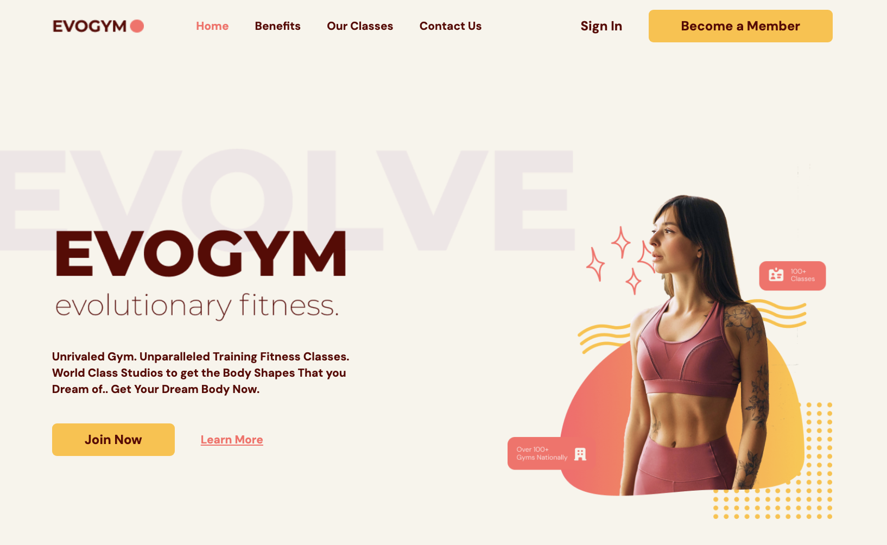

# Frontend Practice Project



## Table of Contents

- [Introduction](#introduction)
- [Technologies Used](#technologies-used)
- [Features](#features)
- [Getting Started](#getting-started)
- [Usage](#usage)
- [Contributing](#contributing)
- [License](#license)
- [Contact](#contact)

## Introduction

This is a frontend practice project built using various modern web technologies. The primary goal of this project is to gain hands-on experience with these tools and frameworks.

## Technologies Used

- **React**: A JavaScript library for building user interfaces.
- **Typescript**: A typed superset of JavaScript that compiles to plain JavaScript.
- **Vite**: A build tool that provides a faster and leaner development experience for modern web projects.
- **Tailwind CSS**: A utility-first CSS framework for rapidly building custom designs.
- **Hero Icons**: A set of free, MIT-licensed high-quality SVG icons for you to use in your web projects.
- **Framer Motion**: A production-ready motion library for React.
- **Form Submit**: A service to handle form submissions.
- **React Anchor Link Smooth Scroll**: A lightweight smooth scrolling library for React.

## Features

- **Responsive Design**: Adapts to different screen sizes seamlessly.

## Getting Started

To get started with this project, clone the repository and install the dependencies:

```bash
git clone https://github.com/yourusername/your-repo-name.git
cd your-repo-name
npm install
